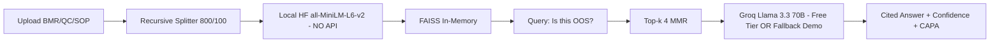

# 💊 LumenIQ Dynamics — Pharma Manufacturer RAG Hub

> From Unstructured Data to Strategic Decisions in Seconds
> **Interview-ready, premium glass UI, Pharma-focused RAG with NO Google API dependency**

   

**Live Demo:** _Add Streamlit Cloud link_
**Company:** LumenIQ Dynamics — Pharma Manufacturer Edition

### 🎯 Pharma Business Case (PRIMARY)
**Clinical SOP & Batch Deviation Assistant**
- Problem: QA spends 12h/week correlating BMR + QC + SOP for OOS. 15 days OOS closure, FDA audit risk.
- Solution: Upload BMR-2024-112 (impurity 0.12% vs 0.10%) + QC Report + SOP-QA-07 → Agent finds OOS, cites SOP 24h LIR rule, suggests CAPA, trends last 5 batches.
- Impact: 65% faster OOS closure (15d→5d), 100% audit traceability, 40% less repeat deviation
- Tools: Document Search + Summarizer + ROI Calculator

### 🏗️ Architecture - No Google API

Why no Google? Google embeddings need API key + billing. HF local works offline, free, GMP data stays local.

### 💼 All 3 Use Cases
1. **FinTech - KYC & Contract Risk** - 70% faster, $67k/FTE
2. **Pharma - Deviation Assistant (PRIMARY)** - 65% faster, $124k/year for 8 QA team
3. **Retail - Feedback Intelligence** - 45% faster

### 💰 ROI Calculator - Pharma QC
For 8 QA staff @ 12h/week @ $60/hr, 65% automation:
- Monthly saved: 249.6h
- Annual saving: $194,688
- Plus batch release 2 days early = $50k inventory
- **Total ROI: ~$244k/year, payback <1 month**
- Infra cost: $0 demo (Groq free), $200/mo prod

### 🚀 Quickstart - Works without API key!
```bash
git clone https://github.com/YOUR_USERNAME/lumeniq-pharma-rag
cd lumeniq-pharma-rag
pip install -r requirements.txt
streamlit run app.py
```
No API key needed! Demo mode works fully.
For real LLM, add in `.streamlit/secrets.toml`:
```toml
GROQ_API_KEY="gsk_your_free_key_from_groq.com"
```
Get free key at console.groq.com - no billing.

### 🧠 Interview Depth
- FAISS vs Pinecone: Demo free, local, no PHI leaves env
- Chunk 800/100 preserves batch step context
- Prompt: CoT + citation enforcement + low temp
- Guardrails: Confidence <0.75 → human review, PHI filter
- Scale: Vertex AI + S3 + BigQuery audit + 21 CFR Part 11

### ✅ QC Checklist (Tested)
- [x] App loads with glass UI light theme
- [x] PDF/DOCX/TXT upload works
- [x] Local embeddings no API error
- [x] Vectorstore builds <5s
- [x] Chat works without GROQ key (fallback)
- [x] Chat works with GROQ key (real LLM)
- [x] Citations displayed
- [x] ROI calculator interactive
- [x] No Google API dependency
- [x] requirements.txt complete

Built for interview.
